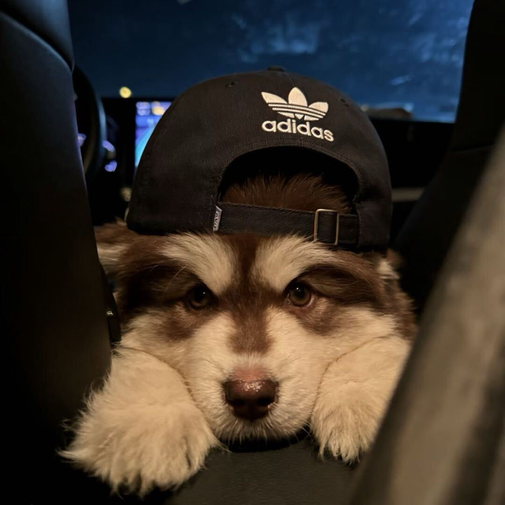

# Yuxin Li

Undergraduate at **Tsinghua University**, Xinya College and the Department of Electronic Engineering.

I work on **computer vision, world models, and harnesses**, with an interest in how embodied agents perceive, remember, and reason about the world.

[Homepage](https://cx300-fh.github.io/) · [Blog](https://cx300-fh.github.io/blog/) · [CV](https://cx300-fh.github.io/cv/) · [Publications](https://cx300-fh.github.io/publications/) · [Gallery](https://cx300-fh.github.io/gallery/) · [Projects](https://cx300-fh.github.io/projects/)

[Email](mailto:li-yx24@mails.tsinghua.edu.cn) · [Download CV](docs/Yuxin-Li-CV.pdf)

### Selected work

- **ParallelWorld: Test-Time Scaling for Embodied Reasoning** (2026)  
  Min Chen, Shengjun Zhang, **Yuxin Li**, Zhang Zhang, Xin Fei, Chong Xia, Yueqi Duan.  
  [Paper](https://arxiv.org/abs/2608.22971) · [Project](https://chen-min-22.github.io/ParallelWorld-page/)
- **MBench: A Comprehensive Benchmark on Memory Capability for Video World Models** (2026)  
  Shengjun Zhang et al., including **Yuxin Li**.  
  [Paper](https://arxiv.org/abs/2606.00793) · [Project](https://peanutup.github.io/MBench-project/) · [Code](https://github.com/study-overflow/MBench)

### Background

- Video generation and world models with Prof. Yueqi Duan, Tsinghua University.
- Future prediction with large language models, Student Research Training with Prof. Yong Li.
- Quadruped navigation and PPO: 13th in the semifinals and 25th in the finals of the Tencent AI Open Competition (Embodied Intelligence Track, 2025).
- Third prize in both tracks of the THUAI9 Artificial Intelligence Challenge (2026).

Python · C++ · PyTorch · Reinforcement learning · Robot navigation

---

Website source: [`website/`](website/). Publishing instructions: [`DEPLOY.md`](DEPLOY.md).
